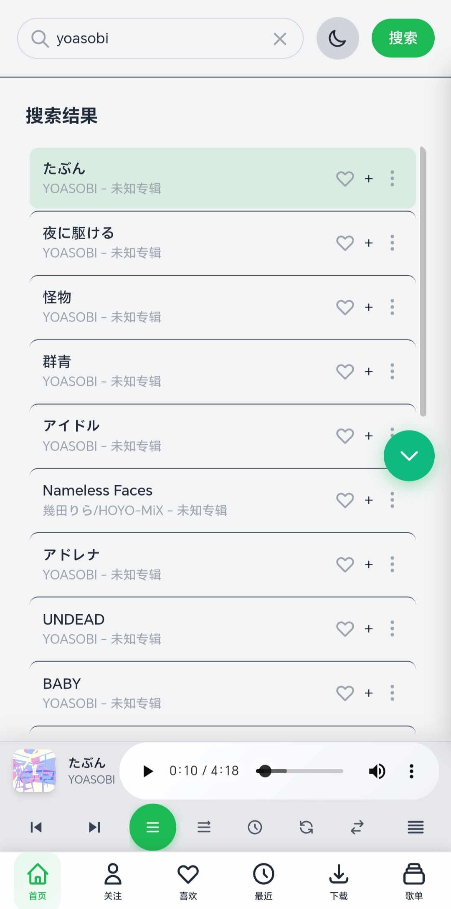
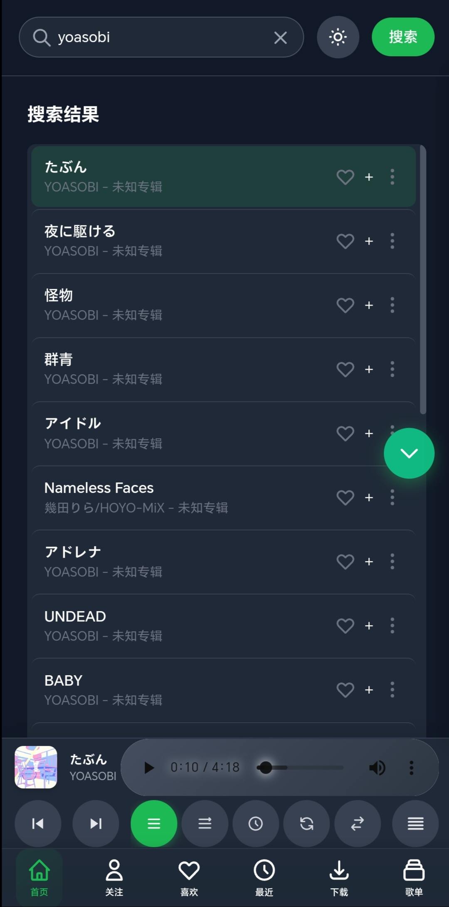
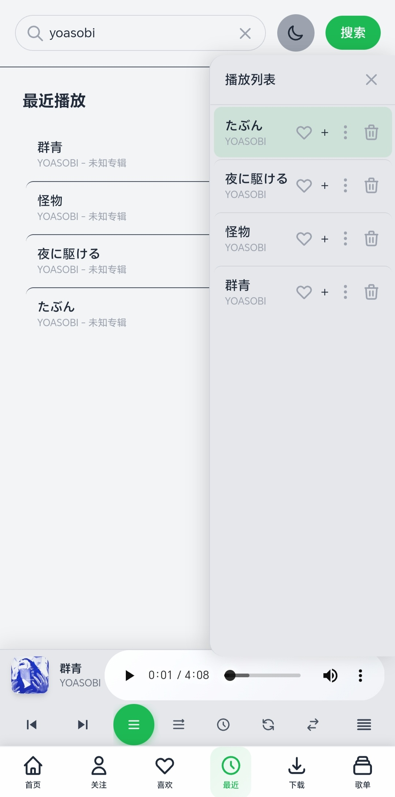
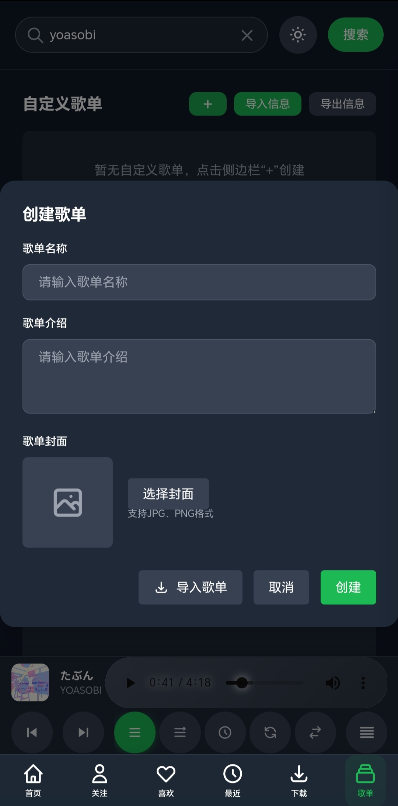
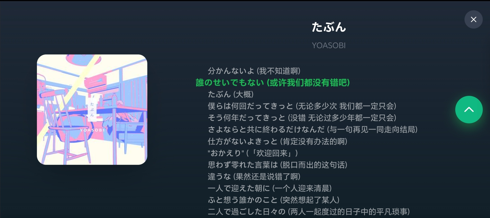
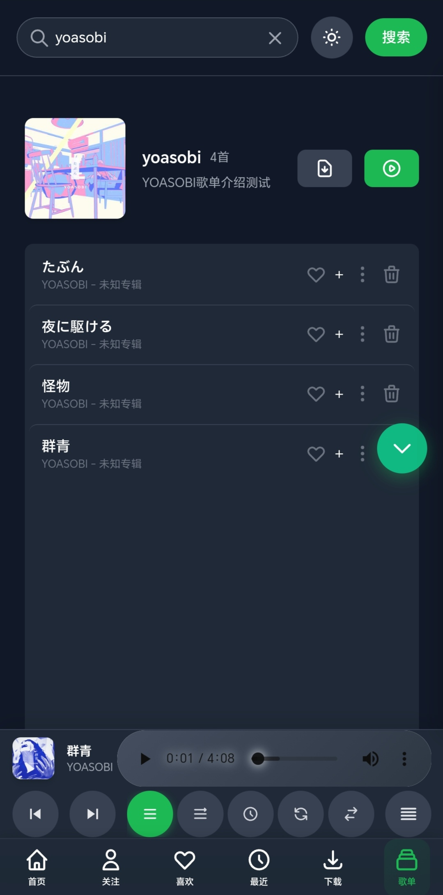

# MusicPlayer 音乐播放器 (Android 适配版)

个人项目，AI生成，仅供学习娱乐，不可商用

## 📋 项目功能

### 核心功能

- 🔍 **音乐搜索**：支持在线搜索音乐
- 🎶 **关注歌手**：一键关注喜爱的歌手
- ❤️ **我喜欢的歌曲**：收藏喜爱的音乐
- 📚 **最近播放**：记录最近播放的歌曲
- 💾 **本地和下载**：支持导入本地音频文件

- 🎵 **自建歌单**：创建和管理个人歌单
- 🎛️ **多种播放模式**：顺序、倒序、单曲循环、列表循环、随机
- 📝 **歌词显示**：实时歌词同步显示
- 🌙 **深色/浅色模式**：根据系统或手动切换
- 🔧 **数据导入导出**：支持个人数据的备份与恢复

### 移动端特色

- **底部导航栏**：便捷的功能切换，包括首页、关注、喜欢、最近、歌单
- **触控优化**：针对触摸屏优化的交互体验
- **响应式设计**：适配不同屏幕尺寸，横屏模式也能正常显示
- **本地存储**：使用 Capacitor Preferences 实现持久化存储
- **离线播放**：支持离线状态下播放本地歌曲

## 📷 项目截图








## 🛠️ 技术栈

- **Capacitor**：跨平台移动应用框架（Android）
- **Tailwind CSS**：实用优先的CSS框架
- **JavaScript**：应用逻辑实现
- **Capacitor Preferences**：数据持久化存储
- **Capacitor Filesystem**：文件系统操作

## 🚀 快速开始

### 1. 环境准备

- **Node.js**：建议使用 LTS 版本
- **Android Studio**：用于构建和调试 Android 应用
- **Java JDK**：版本 11 或以上

### 2. 安装依赖

```bash
# 克隆仓库
git clone git@github.com:AH23333/restruct-music-player-android.git
cd restruct-music-player-android

# 安装依赖
npm install

# 安装 Capacitor 依赖
npm install @capacitor/android @capacitor/cli --save
```

### 3. 构建和运行

#### Android 端

```bash
# 构建 Web 应用
npm run build

# 同步项目到 Android
npx cap sync

# 打开 Android Studio 进行构建
npx cap open android

# 使用 Gradle 构建 Debug APK
# 在项目根目录执行
cd android
./gradlew assembleDebug
```

#### 调试模式

```bash
# 启动开发服务器
npm run dev

# 同步到 Android 并运行
npx cap sync
npx cap run android
```

## 📁 项目结构

```
restruct-music-player-android/
├── android/                            # Android 项目
│   ├── app/                            # Android 应用
│   │   ├── src/
│   │   │   ├── androidTest/            # 测试代码
│   │   │   ├── main/                   # 主要代码
│   │   │   │   ├── java/com/example/musicplayer/  # Java 代码
│   │   │   │   ├── res/                # 资源文件
│   │   │   │   └── AndroidManifest.xml # 应用配置
│   │   │   └── test/                   # 单元测试
│   │   └── build.gradle                # 应用构建配置
│   ├── gradle/                         # Gradle 配置
│   └── gradlew                         # Gradle Wrapper 脚本
├── src/                                # 源代码
│   ├── config/                         # 配置文件
│   │   ├── forge.config.js             # Electron Forge 配置
│   │   ├── postcss.config.js           # PostCSS 配置
│   │   └── tailwind.config.js          # Tailwind 配置
│   ├── main/                           # Electron 主进程（保留）
│   │   ├── services/                   # 主进程服务
│   │   │   ├── logger.js               # 日志服务
│   │   │   ├── storage.js              # 文件读写服务
│   │   │   └── update.js               # 更新服务
│   │   ├── ipcHandlers.js              # IPC 通信处理器
│   │   ├── main.js                     # 主进程入口
│   │   └── preload.js                  # 预加载脚本
│   └── renderer/                       # 前端代码
│       ├── js/                         # JavaScript 代码
│       │   ├── modules/                # 功能模块
│       │   │   ├── diyPlaylists.js     # 自建歌单管理
│       │   │   ├── followed.js         # 关注歌手管理
│       │   │   ├── liked.js            # 我喜欢管理
│       │   │   ├── local.js            # 本地歌曲管理
│       │   │   ├── lyrics.js           # 歌词管理
│       │   │   ├── player.js           # 播放器核心
│       │   │   ├── playlist.js         # 播放列表管理
│       │   │   ├── recent.js           # 最近播放管理
│       │   │   └── search.js           # 搜索功能
│       │   ├── services/               # 服务
│       │   │   ├── api.js              # API 调用
│       │   │   ├── storage.js          # 存储服务
│       │   │   └── storageAdapter.js   # 存储适配器（兼容 Android）
│       │   ├── store/                  # 状态管理
│       │   │   ├── actions.js          # 状态变更函数
│       │   │   ├── index.js            # 状态存储
│       │   │   └── state.js            # 初始状态
│       │   ├── utils/                  # 工具函数
│       │   │   ├── dom.js              # DOM 操作
│       │   │   └── helpers.js          # 通用工具
│       │   └── app.js                  # 应用入口
│       ├── styles/                     # 样式文件
│       │   └── style.css               # 全局样式
│       └── index.html                  # 主界面 HTML
├── .gitignore                          # Git 忽略文件
├── README.md                           # 项目说明
├── package.json                        # 项目配置
└── package-lock.json                   # 依赖锁定文件
```

## 💾 数据存储

- **Android**：使用 Capacitor Preferences 存储在应用私有空间
- **数据类型**：
  - 搜索历史
  - 自建歌单
  - 我喜欢的歌曲
  - 最近播放
  - 关注歌手

## ⚠️ 注意事项

- 本项目仅供学习和娱乐使用，不可商用
- 歌曲搜索功能依赖于网络 API，可能会受到网络环境影响
- 首次启动时，Capacitor 初始化可能需要一些时间

## 🤝 贡献指南

1. **创建 Issue**：描述您的功能建议或问题
2. **Fork 仓库**：创建您的个人分支
3. **开发**：实现功能或修复问题
4. **提交 PR**：详细说明您的更改内容

## 🔄 开发指南

### 二次开发注意事项

- 项目已针对 Android 平台优化
- 如需在其他平台部署，可能需要进行额外的适配
- 开发前请确保安装了所有依赖

## 📚 参考项目

- [aura-music](https://github.com/dingyi222666/aura-music.git)
- [Meting](https://github.com/metowolf/Meting.git)

# 📝 更新日志

## 2026.3.29

- 发布第一版apk，预计之后不再维护安卓端
- 修复了数据持久化问题，确保应用重启后数据不丢失
- 优化了搜索功能，添加了 API fallback 机制
- 修复了歌单封面显示问题
- 优化了歌词解析和显示
- 修复了横屏模式显示问题
- 美化了播放器按钮和 UI 界面
